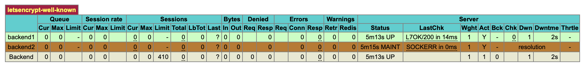
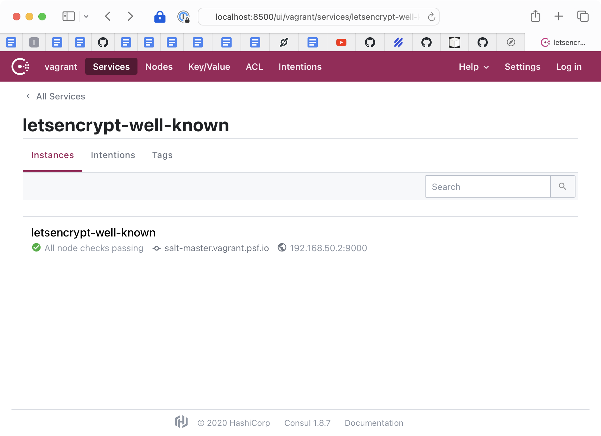

Register a service with haproxy
===============================

1.  Ensure that the `salt-master` and `loadbalancer` can be brought up with vagrant locally:
    ```console
    vagrant up salt-master
    vagrant up loadbalancer
    ```

2.  In the local repository, create a new state/directory to manage files for your service:
    ```console
    touch salt/base/salt.sls
    ```

3.  Additionally, add an `nginx` configuration state and `consul` service state that exposes that directory over HTTP:
    - This configuration might look similar to an existing haproxy service like `letsencrypt`
    ```yaml
    /etc/nginx/sites.d/letsencrypt-well-known.conf:
      file.managed:
        - source: salt://base/config/letsencrypt-well-known-nginx.conf
        - user: root
        - group: root
        - mode: "0644"
        - require:
          - file: /etc/nginx/sites.d/
          - sls: tls.lego
    
    /etc/consul.d/service-letsencrypt-well-known.json:
      file.managed:
        - source: salt://consul/etc/service.jinja
        - template: jinja
        - context:
            name: letsencrypt-well-known
            port: 9000
        - user: root
        - group: root
        - mode: "0644"
        - require:
          - pkg: consul-pkgs
    ```

4. In your local repository, navigate to `salt/base/config` and add an `nginx` configuration file:
  This configuration file might look similarly to the one of the `letsencrypt` service: 
    ```nginx
    server {
      listen 9000 ssl default_server;
    
      ssl_certificate /etc/ssl/private/salt.psf.io.pem;
      ssl_certificate_key /etc/ssl/private/salt.psf.io.pem;
    
      server_name _;
    
      location /.well-known/acme-challenge/ {
          alias /etc/lego/.well-known/acme-challenge/;
          try_files $uri =404;
      }
    }
    ~
    ```

5. Add an entry in `pillar/base/haproxy.sls` to create the haproxy configuration:
    ```
    letsencrypt-well-known:
      domains: []
      verify_host: salt.psf.io
      check: "GET /.well-known/acme-challenge/sentinel HTTP/1.1\\r\\nHost:\\ salt.psf.io"
    ```

    This will render given the template in `salt/haproxy/config/haproxy.cfg.jinja` to create
    a service which has two "slots" that will be filled based on the DNS resolution of the consul
    service registered in step 3.

6.  Prepare an SSH configuration file to access the host with native ssh commands:
    ```console
    vagrant ssh-config salt-master loadbalancer >> vagrant-ssh
    ```

7.  Open an SSH session with port forwarding to the haproxy status page:
    ```console
    ssh -L 4646:127.0.0.1:4646 -F vagrant-ssh loadbalancer
    ```
    - Open [`http://localhost:4646/haproxy?stats`][loadbalancer] to see ``haproxy`` status

    

    You will see the two "slots" registered in haproxy, with one host found via Consul DNS.

    - Green indicates the host exists, was resolved, and is passing health check.
    - Brown indicates that a slot does not have a host, in other words not enough hosts were resolved, so it is reserved in "maintenance" state.
    - Red would indicate that a host exists, was resolved, and is failing health check.

8.  In a new window run:
    ```console
    ssh -F sshconfig -L 8500:127.0.0.1:8500 salt-master
    ```
    - Open [`http://localhost:8500/ui/vagrant/services`][consul] to see what ``consul`` services are registered

    

    You can browse to see what services have been registered, and what nodes are advertising that service.

[//]: # (Quicklink targets)
[loadbalancer]: <http://localhost:4646/haproxy?stats>
[consul]: <http://localhost:8500/ui/vagrant/services>
